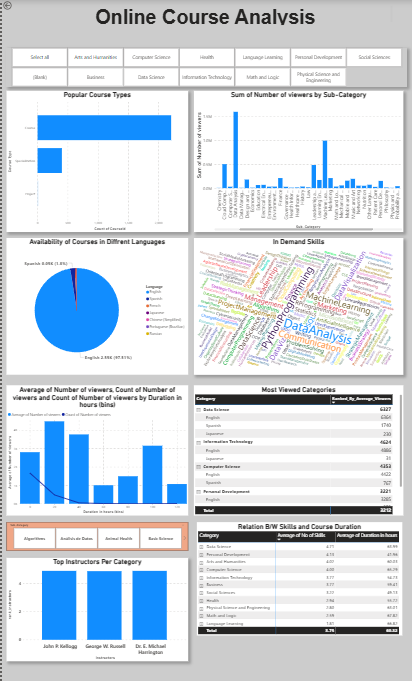
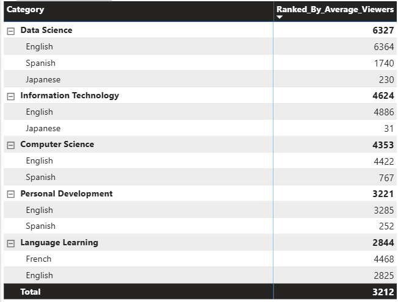
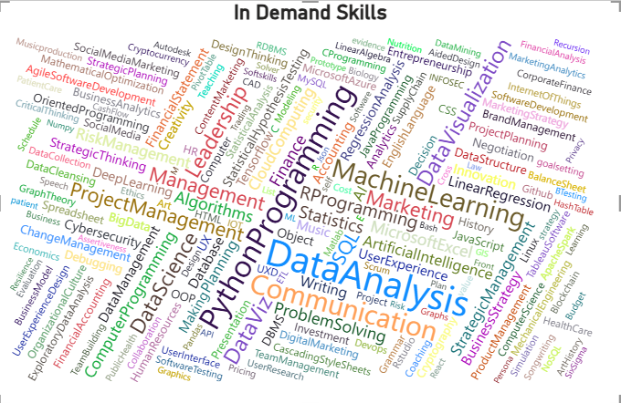
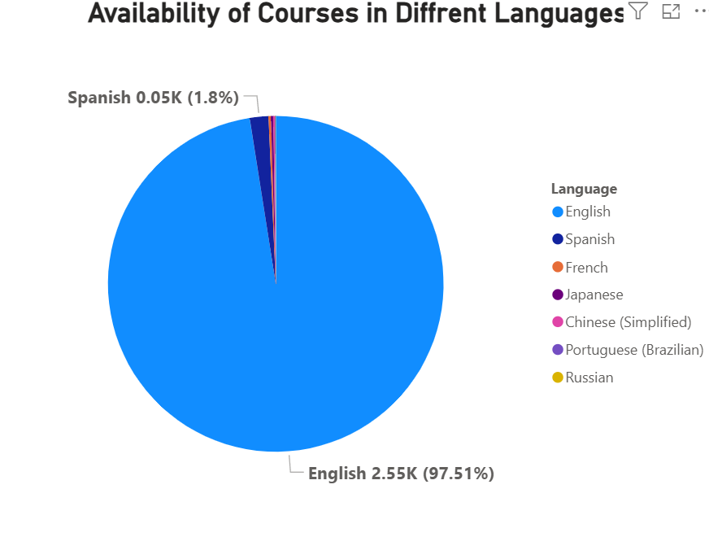
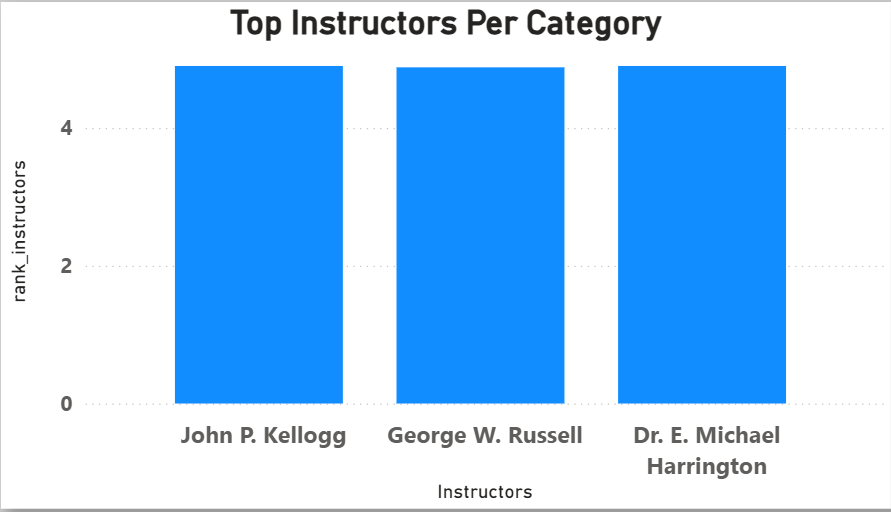
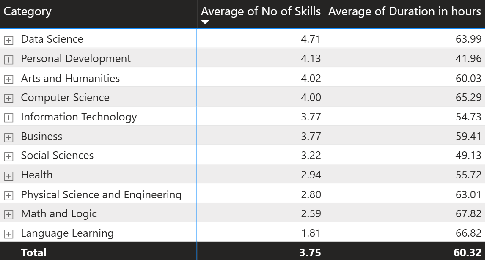

# Online Course Analytics  Power BI Dashboard

An analysis of an online learning platform's course catalogue, built in Power BI to answer eight business questions about content strategy, learner engagement, and market positioning.



---

## The Brief

A client wants to enter the online course market. Before committing to content production, they need to understand the existing landscape: which categories are crowded, what formats dominate, which skills are in demand, and what actually drives viewership.

## The Data

Online recorded courses across **11 categories** and **46 sub-categories**, with fields for course type, category, language, skills taught, duration, instructor, rating, and viewer counts.

## Approach

Data imported and shaped in **Power Query**, modelled in **Power BI**, analysed through **DAX** measures. Two transformations applied before analysis:

- **Duration normalisation** — courses listed in months converted at 60 hours per month; flexible self-paced courses assigned a nominal 200 hours.
- **Duration binning** — hours grouped into 20-hour bands so averages rested on enough courses to be reliable.

---

## Findings

### 1. Course distribution across categories

The catalogue spans 11 categories and 46 sub-categories with three course types: Course, Specialisation, and Guided Project. The standard Course format dominates in every single category. Volume concentrates in **Business, Data Science, and Computer Science**, while **Personal Development and Math & Logic** have the thinnest catalogues.

| | |
|---|---|
| Categories | 11 |
| Sub-categories | 46 |
| Course types | 3 |

> **What this means:** There's no category where the client would face real competition in Specialisations or Guided Projects. That's an open gap, especially in Data Science and Computer Science, where learners are most likely to want structured multi-course pathways.

---

### 2. Average views by category and language



| Category | Avg. viewers |
|---|---|
| Data Science | 6,327 |
| Information Technology | 4,624 |
| Computer Science | 4,353 |
| Personal Development | 3,221 |
| Language Learning | 2,844 |
| **Catalogue average** | **3,212** |

The language split is stark: within Data Science, English averages 6,364 views against 1,740 for Spanish and 230 for Japanese. Information Technology is sharper still — 4,886 for English, 31 for Japanese.

One exception stands out. In Language Learning, French courses average **4,468** views against **2,825** for English — the only place in the entire catalogue where a non-English language outperforms English. A narrow signal, but a genuine one.

> **What this means:** Technical categories pull roughly double the engagement of soft-skill ones. Data Science, IT, and Computer Science are the priority areas for investment. The French result in Language Learning is the one case where non-English content demonstrably outperforms, and is worth treating as a distinct opportunity rather than an anomaly to ignore.

---

### 3. Most commonly taught skills



The catalogue covers **13 distinct skills**. The most common are Data Analysis, Python, Communication, and Machine Learning — technical and quantitative, with Communication the only soft skill in the top tier. **Python Programming** is the most cross-cutting skill, leading in all three of the highest-volume categories.

> **What this means:** Python has become general-purpose infrastructure rather than a specialist skill — a low-risk content investment because learners arrive at it from several directions. The narrow overall skill set also suggests room to differentiate on skills the market underserves.

---

### 4. Language distribution



Courses exist in seven languages: English, Spanish, French, Japanese, Russian, Chinese, and Portuguese.

| Language | Share |
|---|---|
| English | 97.5% |
| Spanish | 1.8% |
| French | 0.23% |
| Remaining four | <0.5% |

> **What this means:** The platform is effectively monolingual. This is a *supply* observation, not a *demand* one — there's so little non-English content that low non-English viewership can't tell us whether the audience exists.

---

### 5. Language preference in the top 5 categories

English leads in all five, with no category close to breaking the pattern. The one signal worth noting: **Marketing** carries a noticeably larger Spanish share than anywhere else in the catalogue — still well below English, but visible.

> **What this means:** Spanish-language Marketing content is worth a small pilot to test whether demand exists. A broader localisation programme isn't supported by anything in this data.

---

### 6. Top instructors by category



Ranked on average rating, the leading instructors are John P. Kellogg, George W. Russell, and Dr. E. Michael Harrington, each at or near a perfect 5.0. This visual is static — it doesn't respond to slicers elsewhere on the page.

> **What this means:** These are the client's strongest partnership candidates. But rating alone is a fragile criterion — three instructors tied at a perfect 5.0 suggests small review volumes rather than genuine separation. A better shortlist would weight rating by review count, so an instructor with 5.0 from ten reviews doesn't outrank one with 4.8 from a thousand.

---

### 7. Course duration and viewership

This one needed care.

The initial chart plotted average views against every individual duration value and showed dramatic spikes, one reaching 26,000 views around 650 hours. Adding a course count alongside the average revealed why: almost the entire catalogue sits below 100 hours, and course counts collapse to single digits beyond that. Those spikes were individual courses, not trends.


Restricting to courses under 150 hours and binning into 20-hour bands gives a reliable picture:

| | |
|---|---|
| Peak engagement band | 20–40h (~4,400 avg views) |
| Views beyond peak | 1k–3.2k, no clear trend |
| Catalogue average duration | 60.32h |

*Average duration by category is fairly uniform, from 41.96 hours (Personal Development) to 67.82 hours (Math & Logic).*

> **What this means:** There's a modest sweet spot around 20–40 hours, but duration isn't a strong engagement lever. Set course length by subject matter, not in pursuit of views. The apparent advantage of very long courses in the raw data is a sampling artifact.

---

### 8. Skill variety and viewership



Average skill count per category runs from **1.81** (Language Learning) to **4.71** (Data Science), against a catalogue average of 3.75. Comparing this against viewership shows no meaningful relationship:

- **Personal Development** — 2nd highest skill variety (4.13), near-bottom on views
- **Information Technology** — below-average variety (3.77), 2nd highest on views
- **Data Science** leads on both, but the pattern breaks immediately below it

*All courses in the dataset are recorded online courses, so no additional filter was needed here.*

> **What this means:** Packing more skills into a course doesn't drive viewership. Subject matter matters far more than breadth. The client should prioritise topic selection over skill count.

---

## Repository contents

```
BI_PROJECT.pbix          Power BI report file
images/                  Dashboard screenshots
README.md                This file
```

## Tools

Power BI Desktop · Power Query · DAX

---

## Note

This project began as a tutorial build and was extended with independent analysis, including the duration investigation in Finding 7 and the reasoning behind each implication.
